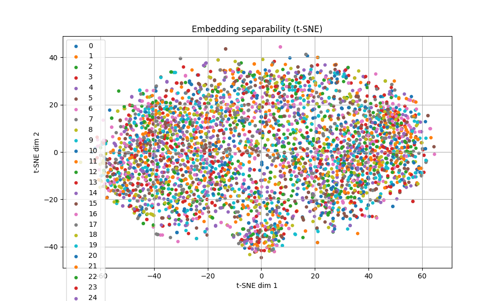

# Iris Recognition with CNN and SVM

This project performs iris-based identity classification using CNNs (EfficientNet), feature embedding extraction, and SVM classification.

## 🧠 Key Components

* **Iris segmentation** using HoughCircles (with fallback mechanism)
* **Feature extraction** using `EfficientNetB0` (without classification head)
* **Embedding normalization** via `L2Normalization`
* **Classification** with either `softmax` or `SVM` on top of embeddings
* **Visualization** of embedding separability using t-SNE
* **Automatic dataset trimming** based on the number of classes
* **Fallback image saving** for failed segmentations

---

## 🗂️ Project Structure

```
.
├── config.py               # Configuration: paths, hyperparameters
├── main.py                 # Main training and evaluation script
├── cnn_pipeline.py         # CNN training pipeline
├── svm_pipeline.py         # SVM classification + PCA + t-SNE
├── segmentation.py         # Iris segmentation
├── data_loader.py          # Dataset loading and caching
├── utils/
│   └── visualization.py    # t-SNE and other plots
├── *.npz / *.keras         # Cached data and model checkpoints
```

---

## 🚀 How to Run

1. Install the dependencies:

```bash
pip install tensorflow opencv-python numpy scikit-learn matplotlib kagglehub
```

2. Start training:

```bash
python main.py --classifier svm  # or use --classifier softmax
```

3. (Optional) Modify `EPOCHS`, `SUBSET`, or `BATCH_SIZE` in `config.py` to fit your setup.

---

## 🧪 Techniques Used

* Circle detection with `cv2.HoughCircles`
* `EfficientNetB0` as a feature extractor
* Custom embedding layer + L2 normalization
* `SVM` with `GridSearchCV` and PCA dimensionality reduction
* t-SNE for visualization

---

## 📊 Sample Output

* Output plot: 
* Evaluation printed to console (classification report)

---

## ⚠️ Notes

* If the number of classes exceeds the configured subset size, it is automatically adjusted.
* Embedding arrays are checked for `NaN` or `Inf` values.
* Segmentation results are cached to `.npz` for faster re-runs.

---

## 📁 Dataset

This project uses the [CASIA Iris Thousand](https://paperswithcode.com/dataset/casia-iris-thousand) dataset.

It can be loaded automatically using `kagglehub` or placed manually in the path defined in `config.py`.

---